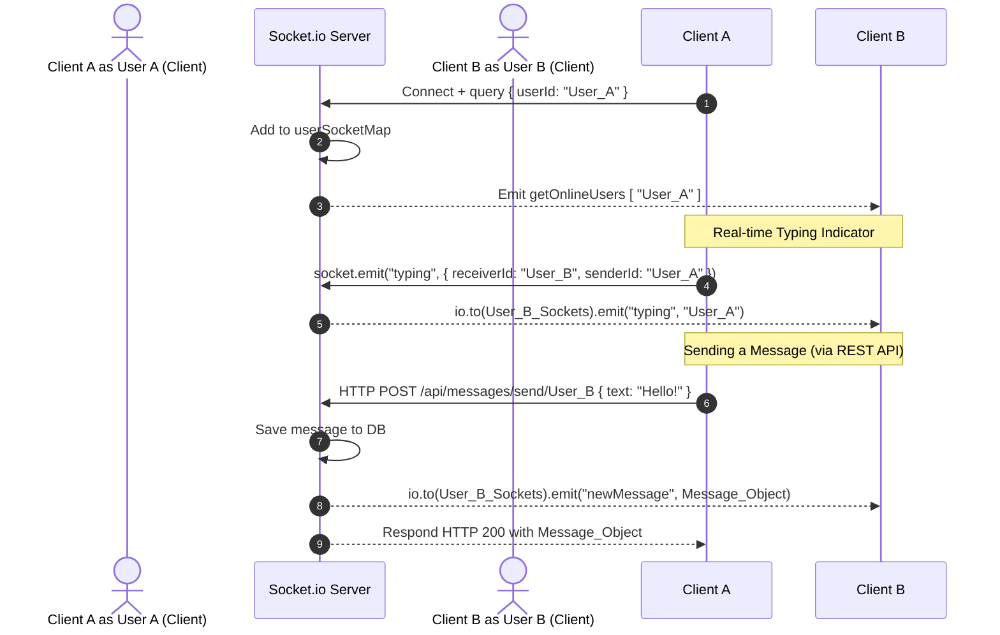

# Chat App Fullstack (Socket.io) - System Documentation

A real-time, full-stack chat application built with a modern web stack: **React (Vite)** on the frontend, **Node.js/Express** on the backend, and **Socket.io** for real-time messaging. This documentation covers the architecture, APIs, data schemas, WebSocket flows, state management, and configuration.

---

## Architecture Overview

The system is split into two primary components:
1. **Backend**: Node.js, Express, Socket.io, MongoDB (Mongoose), Cloudinary (image storage), Resend (emails), and Arcjet (security).
2. **Frontend**: React (Vite), Tailwind CSS v4, DaisyUI v5 (UI styling), Zustand (state management), and Socket.io Client.

```mermaid
graph TD
    subgraph Frontend [React Client]
        UI[React Components]
        Store[Zustand Stores]
        SocketClient[Socket.io Client]
    end

    subgraph Backend [Node.js & Express Server]
        AuthRouter[/api/auth]
        MsgRouter[/api/messages]
        SocketServer[Socket.io Server]
        Middleware[Auth & Security Middleware]
    end

    subgraph Database & Services
        DB[(MongoDB Atlas)]
        Cloudinary[(Cloudinary Media Storage)]
        Resend[Resend Email Service]
    end

    UI --> Store
    Store -->|Axios HTTP Requests| AuthRouter
    Store -->|Axios HTTP Requests| MsgRouter
    SocketClient <-->|WebSocket Events| SocketServer

    AuthRouter --> Middleware
    MsgRouter --> Middleware

    Middleware --> DB
    MsgRouter --> Cloudinary
    AuthRouter --> Resend
```

---

## Core Components

### 1. Database Schemas (MongoDB / Mongoose)

The backend utilizes two Mongoose schemas:

#### User Schema
* **File**: `backend/src/models/User.js`
* **Properties**:
  * `email` (String, required, unique): The user's email address.
  * `fullName` (String, required): The user's display name.
  * `password` (String, required, minLength: 6): Hashed using `bcryptjs`.
  * `profilePic` (String, default: `""`): Cloudinary secure URL for user avatar.
  * *Timestamps*: Automatic `createdAt` and `updatedAt` properties.

#### Message Schema
* **File**: `backend/src/models/Message.js`
* **Properties**:
  * `senderId` (ObjectId, ref: `"User"`, required): Sender's User ID.
  * `receiverId` (ObjectId, ref: `"User"`, required): Receiver's User ID.
  * `text` (String, trim: true, maxLength: 2000): Text message.
  * `image` (String): Cloudinary secure URL for attached images (optional).
  * *Timestamps*: Automatic `createdAt` and `updatedAt` properties.

---

### 2. Backend API Endpoints

All endpoints are prefix-based:
- Authentication: `/api/auth`
- Messages: `/api/messages`

| Component | HTTP Method | Route Path | Auth Required | Description |
| :--- | :--- | :--- | :--- | :--- |
| **Auth** | `POST` | `/signup` | No | Creates a user, hashes password, sets a `jwt` cookie, and sends a welcome email. |
| **Auth** | `POST` | `/login` | No | Validates credentials, sets a `jwt` cookie. |
| **Auth** | `POST` | `/logout` | No | Clears the `jwt` cookie. |
| **Auth** | `PUT` | `/update-profile` | Yes | Uploads base64 avatar to Cloudinary and updates `profilePic`. |
| **Auth** | `GET` | `/check` | Yes | Returns the authenticated user's profile details. |
| **Message** | `GET` | `/contacts` | Yes | Retrieves all registered users (excluding password) except the current user. |
| **Message** | `GET` | `/chats` | Yes | Retrieves users that the current user has sent/received messages from. |
| **Message** | `GET` | `/:id` | Yes | Retrieves chat message history between the current user and target user ID. |
| **Message** | `POST` | `/send/:id` | Yes | Sends a new message (text/image) to a user, uploads attachments to Cloudinary, and emits a socket event. |

---

### 3. Real-Time Communications (Socket.io)

Real-time flows are managed via `backend/src/lib/socket.js`. The server maintains a mapping (`userSocketMap`) of `userId -> Set<socketId>` to support multiple tabs or logins for a single user.

#### Connection Flow
1. **Handshake**: The client sends a connection request passing `userId` in `socket.handshake.query.userId`.
2. **Registry**: The server registers the socket under the corresponding user's `Set` inside `userSocketMap`.
3. **Broadcasting**: The server broadcasts an active list of user IDs via the `getOnlineUsers` event.

#### Real-time Events
* **`typing` / `stopTyping`**: Sends feedback to the receiver socket that a specific user is currently typing.
* **`newMessage`**: Emitted from the backend when a user calls `sendMessage`. Emitted only to the receiver's connected sockets.
* **`getOnlineUsers`**: Pushes the active user list to all connected clients.



---

### 4. Client State Management (Zustand)

The frontend features two Zustand stores:

#### `useAuthStore`
* **State variables**:
  * `authUser`: The currently authenticated user object (or null).
  * `isCheckingAuth`, `isSigningUp`, `isLoggingIn`: Loading flags.
  * `onlineUsers`: Array of active user IDs.
  * `socket`: Connected socket client instance.
* **Key Actions**:
  * `checkAuth()`: Queries `/auth/check`. On success, sets `authUser` and triggers `connectSocket()`.
  * `signup(data)` / `login(data)`: Sends authentication requests and opens a WebSocket connection.
  * `logout()`: Cleans up credentials, calls `/auth/logout`, disconnects the socket, and resets the chat state.
  * `connectSocket()`: Connects to the Node server using `socket.io-client` with credentials support.

#### `useChatStore`
* **State variables**:
  * `allContacts`: Array of all directory contacts.
  * `chats`: Array of users with existing conversation history.
  * `messages`: Array of messages in the active conversation.
  * `activeTab`: `"chats"` or `"contacts"`.
  * `selectedUsers`: Target user object.
  * `isUsersLoading`, `isMessagesLoading`, `isSendingMessage`: Loading states.
  * `isTyping`: Status of the peer typing.
  * `isSoundEnabled`: Setting for notification sounds.
* **Key Actions**:
  * `getMessagesById(userId)`: Loads chat history.
  * `sendMessage(messageData)`: Sends text/images to the selected user.
  * `subscribeToMessages()` / `unsubscribeFromMessages()`: Adds or removes handlers on the socket instance to capture incoming `typing`, `stopTyping`, and `newMessage` events.
  * `startTyping()` / `stopTyping()`: Emits peer typing status over the WebSocket.

---

### 5. Services Integration & Configuration

* **Cloudinary**: Handles photo uploads. Configured inside `backend/src/lib/cloudinary.configure.js`. Base64-encoded strings uploaded from the client are securely sent to Cloudinary and returned as HTTPS URLs.
* **Resend**: Triggers transactional onboarding emails via `backend/src/lib/resend.configue.js` when users sign up.
* **Arcjet (Security Platform)**: Includes rules for SQL/Common attacks protection (`shield`), Bot Detection (`detectBot`), and Rate Limiting (`slidingWindow` rate limiter) configured in `backend/src/lib/arcjet.configure.js`.
  * *Note*: The `arcjetProtection` middleware is implemented in `backend/src/middleware/arcjet.middleware.js` but is currently commented out in `backend/src/routes/auth.route.js` (available for activation).

---

## Setup & Running Locally

### Prerequisites
- Node.js (v18+)
- MongoDB connection string (local or MongoDB Atlas)
- Accounts for Cloudinary, Resend, and Arcjet (optional, though required for email/image upload features)

### Environment Variables (`backend/.env`)

Create a `.env` file in the `backend` folder matching this configuration structure:

```env
PORT=3000
MONGO_URI=your_mongodb_connection_uri
NODE_ENV=development
JWT_SECRET=your_jwt_signing_secret
CLIENT_URL=http://localhost:5173

# Resend Mail Configuration
RESEND_API_KEY=your_resend_api_key
EMAIL_FROM=onboarding@resend.dev
EMAIL_FROM_NAME=YourAppName

# Cloudinary Integration
CLOUDINARY_CLOUD_NAME=your_cloudinary_cloud_name
CLOUDINARY_API_KEY=your_cloudinary_api_key
CLOUDINARY_API_SECRET=your_cloudinary_api_secret

# Arcjet Protection
ARCJET_API_KEY=your_arcjet_api_key
ARCJET_ENV=development
```

### Run Commands

#### Backend Execution
```bash
cd backend
npm install
npm run dev
```

#### Frontend Execution
```bash
cd frontend
npm install
npm run dev
```
By default, the client runs on `http://localhost:5173` and requests are proxy-configured or axios-routed to the backend at `http://localhost:3000`.
